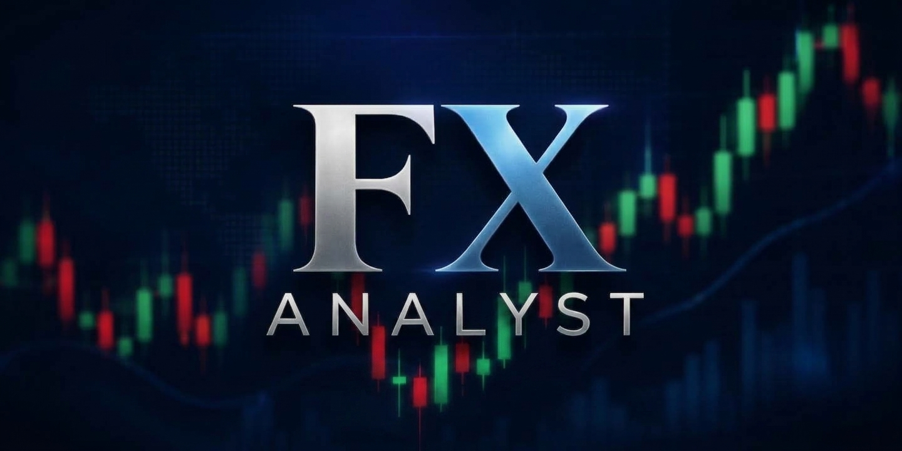

# FX Analyst

An AI-powered forex and gold market analyst, live at **[forex-analyst.vercel.app](https://forex-analyst.vercel.app/)**.

This isn't a signal-selling bot and it doesn't place trades for you. It watches live currency and gold prices, runs them through a technical feature-engineering pipeline and six locally-trained machine learning models, and produces recommendations you can actually interrogate — trend, confidence, risk, expected reward, the indicators behind the call, and the exact conditions that would invalidate it. If the evidence isn't strong enough, it says so and recommends no trade, instead of forcing a call just because you asked for one.

## What it actually does

- Streams live prices for major forex pairs and XAU/USD, stores historical candles, and shows them as real candlestick charts
- Computes its own technical indicators and price-action features (RSI, MACD, ADX, Bollinger Bands, market structure, liquidity sweeps, fair value gaps — all built in-house, no third-party TA library)
- Runs six machine learning models — trend, entry quality, confidence, risk, reward, and market regime — trained on your own historical data, right in the app
- Combines all six into one explainable recommendation, never a bare buy/sell
- Lets you backtest a library of real trading strategies (trend following, SMC/liquidity, range trading, breakout, swing, scalping) against historical data with realistic spread and slippage
- Gives you a paper trading account with a virtual portfolio, live stop-loss/take-profit execution, and a full trade journal
- Has a full account system — registration with email verification, password reset, account deletion — all backed by proper JWT auth with rotating refresh tokens

## Tech stack

**Frontend:** React 19, TypeScript, Vite, Material UI, TradingView Lightweight Charts, Recharts
**Backend:** Python, FastAPI, SQLAlchemy, Alembic
**Database:** PostgreSQL with TimescaleDB (Neon)
**AI/ML:** scikit-learn, XGBoost, LightGBM, pandas, NumPy — no external AI API, everything runs and trains inside the app itself
**Real-time:** WebSockets over Redis pub/sub (Upstash)
**Hosting:** Vercel (frontend), Northflank (backend)

Every tool in this stack is free and open-source. That was a deliberate constraint from day one, not an afterthought.

## Running it yourself

You'll need Python 3.12+, Node 20+, PostgreSQL with the TimescaleDB extension, and Redis.

```
cd backend
python3 -m venv venv
source venv/bin/activate
pip install -r requirements.txt
cp .env.example .env
alembic upgrade head
uvicorn app.main:app --reload --port 8000

```
cd frontend
npm install
cp .env.example .env
npm run dev


You'll need a free API key from [Twelve Data](https://twelvedata.com) for market data, and a Postgres connection string with the `timescaledb` extension enabled. Fill both into `backend/.env` before starting the backend.

## A few honest notes

The free market-data plan restricts live streaming to a small set of "trial" symbols — right now that's EUR/USD and XAU/USD showing live prices, while everything else works fine for historical data, backtesting, and AI analysis, just without a live-updating ticker. Good enough for a personal project; a paid data plan would lift that if it ever needed to.

The execution engine — the part that could place real trades with a real broker — exists architecturally but is disabled by default and has no broker connected. That's intentional. This tool is for analysis, not for handing your account over to an algorithm.

## License

MIT © 2026 Alvin Kipng'eno Langat